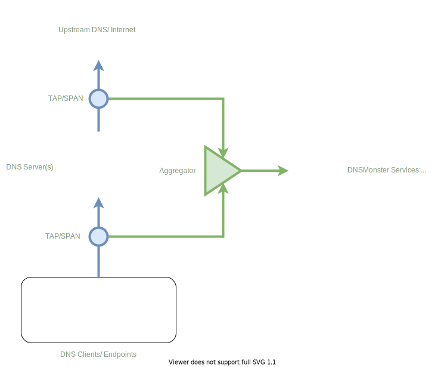
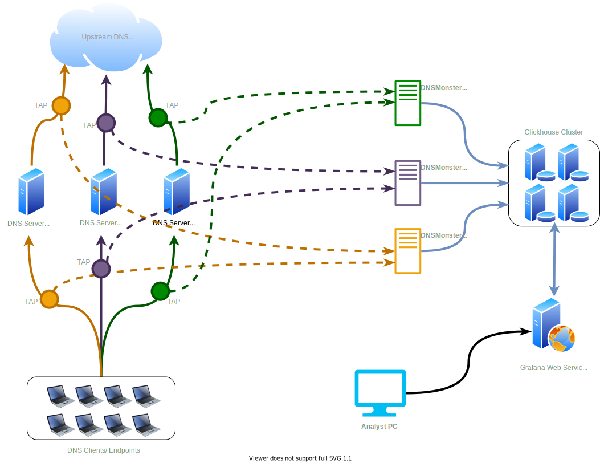

# DNS Monster

Passive DNS collection and monitoring built with Golang, Clickhouse and Grafana: [Blogpost](https://blog.n0p.me/dnsmonster/)


# Quick start

## AIO Installation using Docker



In the example diagram, the egress/ingress of the DNS server traffic is captured, after that, an optional layer of packet aggregation is added before hitting the DNSMonster Server. The outbound data going out of DNS Servers is quite useful to perform cache and performance analysis on the DNS fleet. If an aggregator is not available for you, you can have both TAPs connected directly to DNSMonster and have two DNSMonster Agents looking at the traffic. 

running `./autobuild.sh` creates multiple containers:

* multiple instances of `dnsmonster` to look at the traffic on any interface. Interface list will be prompted as part of `autobuild.sh`
* an instance of `clickhouse` to collect `dnsmonster`'s output and saves all the logs/data to a data and logs directory. Both will be prompted as part of `autobuild.sh`
* an instance of `grafana` looking at the `clickhouse` data with pre-built dashboard.

## What's the retention policy

The default retention policy for the DNS data is set to 30 days. You can change the number by building the containers using `./autobuild.sh`.

NOTE: to change a TTL at any point in time, you need to directly connect to the Clickhouse server using a `clickhouse` client and run the following SQL statement (this example changes it from 30 to 90 days):

`ALTER TABLE DNS_LOG MODIFY TTL DnsDate + INTERVAL 90 DAY;` 

## AIO Demo

[](static/aio_demo.svg)


## Scalable deployment Howto

### Clickhouse Cluster



### Set up a ClickHouse Cluster

Clickhouse website provides an excellent tutorial on how to create a cluster with a "virtual" table, [reference](https://clickhouse.tech/docs/en/getting-started/tutorial/#cluster-deployment). Note that `DNS_LOG` has to be created virtually in this cluster in order to provide HA and load balancing across the nodes. 

Configuration of Agent as well as Grafana is Coming soon!

# Build Manually

Make sure you have `libpcap-devel` package installed

`go get gitlab.com/mosajjal/dnsmonster/src`

## Static Build (WIP)

```
 $ git clone https://gitlab.com/mosajjal/dnsmonster
 $ cd dnsmonster/src/
 $ go get
 $ go build --ldflags "-L /root/libpcap-1.9.1/libpcap.a -linkmode external -extldflags \"-I/usr/include/libnl3 -lnl-genl-3 -lnl-3 -static\"" -a -o dnsmonster
```

## pre-built Binary

There are two binary flavours released for each release. A statically-linked self-contained binary built against `musl` on Alpine Linux, which will be maintained [here](`n0p.me/bin/dnsmonster`), and dynamically linked binaries for Windows and Linux, which will depend on `libpcap`. These releases are built against `glibc` so they will have a slight performance advantage over `musl`. These builds will be available in the [release](https://github.com/mosajjal/dnsmonster/releases) section of Github repository. 
